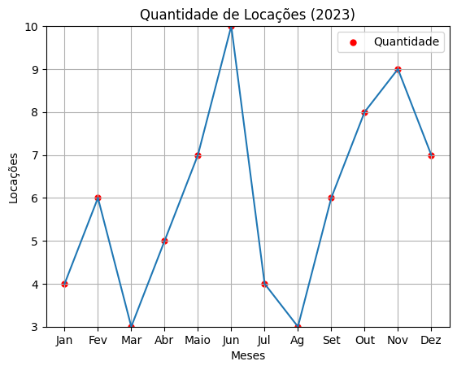
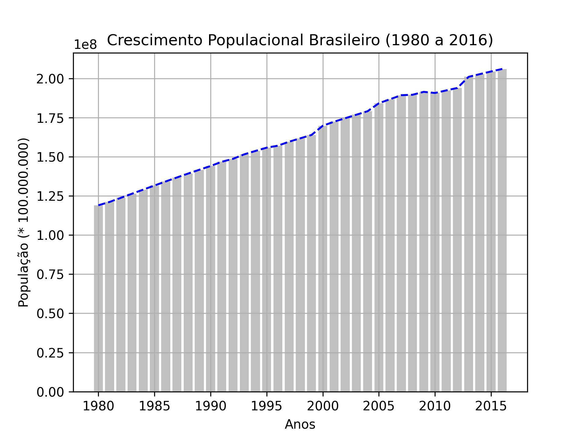
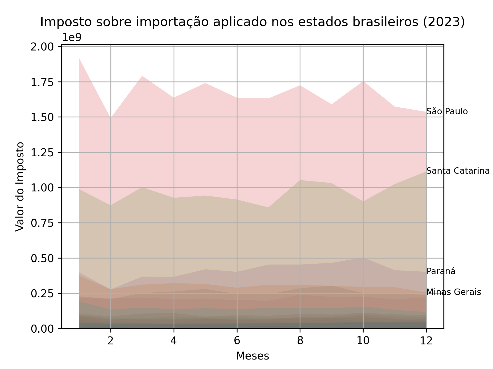

<h1 align="center">Visualização de Dados com MATPLOTLIB</h1>

<p align="center">Estudos de caso e introdução à biblioteca</p>

# ABOUT

Este repositório agrupa a minha introdução a biblioteca para visualização de dados através de gráfico elaborados com Python, além de alguns estudos de casos e as fontes de onde os dados foram retirados.

## TOOLS

<div align="center">
  <figure>
    
    <figcaption><h3>PYTHON</h3></figcaption>
    <figcaption>Linguagem de Programação</figcaption>
  </figure>
</div>

<div align="center">
  <figure>
    
    <figcaption><h3>MATPLOTLIB</h3></figcaption>
    <figcaption>Biblioteca</figcaption>
  </figure>
</div>

## INTRODUÇÂO

Matplotlib.pyplot é uma biblioteca para a criação de gráficos utilizando a linguagem Python, a biblioteca permite inserir dados nos eixos (x e y, e z no caso de gráficos tridimensionais) para elaborar o gráfico, tornando eficiente a visualização desses dados. A biblioteca permite a criação dos mais variados tipos de gráficos, desde gráficos de linhas mais comuns e minimalistas até gráficos volumétricos 3D, seguem abaixo alguns exemplos:

```python
import matplotlib.pyplot as plt

meses = ['Jan', 'Fev', 'Mar', 'Abr', 'Maio', 'Jun', 'Jul', 'Ag', 'Set', 'Out', 'Nov', 'Dez']
locacoes = [4, 6, 3, 5, 7, 10, 4, 3, 6, 8, 9, 7]

plt.ylim(3,10)

plt.title('Quantidade de Locações (2023)') #Inserção do título do gráfico

plt.grid()

plt.scatter(meses, locacoes, label = 'Quantidade', color = 'r', marker = '.', s = 100)
plt.legend() #scatter adicionar marcações ao gráfico e podem receber um label para ser apresentado como legenda

plt.xlabel('Meses') #estabelecem os rótulos dos eixos
plt.ylabel('Locações')

#plt.savefig('nome_da_imagem.png') #comando para salvar o gráfico gerado

plt.plot(meses, locacoes) #após a definição das caractrísticas e dados do gráfico "plotamos" ele e usamos o show para exibí-lo
plt.show()
```

No código apresentado fazemos a importação da biblioteca e atribuímos dados fictícios as variáveis “meses” e “locacoes”, o objetivo do gráfico será apresentar uma visão da quantidade de locações feitas por uma pequena imobiliária durante um ano. O resultado está logo abaixo:



## ESTUDOS DE CASO

<h3>Crescimento da população brasileira</h3>

Dados retirados de planilha fornecida pelo DATASUS que demonstra o crescimento da população brasileira de 1980 a 2016.

[Planilha com os dados](data/populacao_brasileira.csv)

```python
import matplotlib.pyplot as plt

dados = open("cases\populacao_brasileira.csv").readlines() #comando que faz a leitura do arquivo com o dados

x = [] #eixos recebem vetores vazios que serão preenchidos através do laço de repetição
y = []

for i in range(len(dados)): #range determina o espaço que o laço irá percorrer e é limitado pelo len
    if i != 0:
        linha = dados[i].split(";") #split determina a separação dos dados no arquivo csv
        x.append(int(linha[0]))
        y.append(int(linha[1]))

#print(x) #prints apenas a título de teste para saber se os eixos estão recebendo os dados corretos
#print(y)

plt.bar(x, y, color="#C0C0C0") #grafico de barras com uma cor menos aparente
plt.plot(x, y, color="b", linestyle = "dashed") #sobreposição do gráfico de barras por um com linhas tracejadas

plt.title("Crescimento Populacional Brasileiro (1980 a 2016)")

plt.xlabel("Anos")
plt.ylabel("População (* 100.000.000)")

plt.grid()

plt.savefig("populacao_brasileira.png", dpi=300)

plt.show()
```
Resultado:



Através do gráfico conseguimos visualizar o crescimento exponencial da população brasileira de 1980 até 2016, demonstrando um crescimento de aproximadamente 73,19%.

<h3>Imposto sobre Importação no Brasil</h3>

Dados retirados diretamente do acesso a informações do governo (https://www.gov.br/acessoainformacao/pt-br) que demonstra (dentre outros valores) o valor do imposto sobre importação no Brasil no ano de 2023

[Planilha com os dados](data/imp-sobre-importação_2023.csv)

```python
# -*- coding: utf-8 -*-

import matplotlib.pyplot as plt
import numpy as np

dados = open("cases/imp-sobre-importação_2023.csv", encoding="utf-8").readlines()

dados_por_estado = {}

#plt.style.use('_mpl-gallery')

for i in range(len(dados)):
    if i != 0:
        linha = dados[i].replace('"', '').split(",") #replace está sendo utilizado para retirar as apas dos valores para que eles possam ser convertidos
        estado = linha[2]
        if estado not in dados_por_estado:
            dados_por_estado[estado] = {'x': [], 'y': []}
        dados_por_estado[estado]['x'].append(int(linha[1])) #utilizamos o dicionário dados_por_estado para que a ferramenta entenda de qual estado os números pertencem
        dados_por_estado[estado]['y'].append(float(linha[3]))

# Plote várias linhas

fig, ax = plt.subplots()

for estado, valores in dados_por_estado.items():
    ax.stackplot(valores['x'], valores['y'], alpha=0.2)


    if valores['y'][-1] > 250000000:
        ax.text(valores['x'][-1], valores['y'][-1], f'{estado}', ha='left', va='center', fontsize=8)


plt.grid()
plt.savefig("imp sobre importação.png", dpi=300)
plt.show()
```
Resultado:



O código realiza uma verificação para demonstrar o rótulo dos estados que possuem um valor de imposto acima de R$ 250.000.000.
